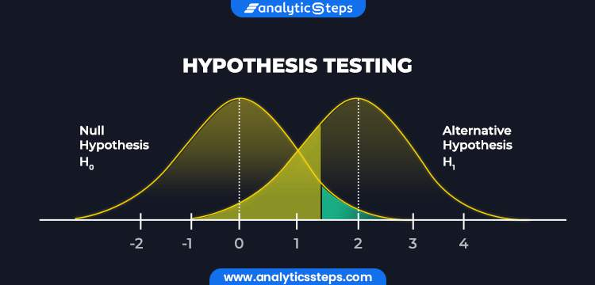
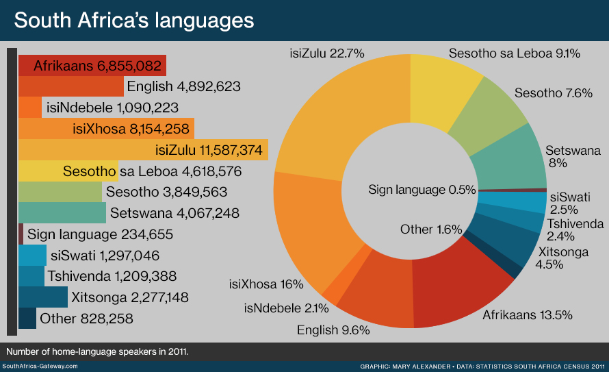

# My Data Science Portfolio - Othuke Ajaye

## About Me
I am a Data Enthusiast who is naturally curious and analytical, keen to turn data into insights. I am a graduate of Electrical/Electronics Engineering and one who is always ready to learn and take on new challenges, a problem solver. You can find my academic journey and work experience on [My Resume](https://drive.google.com/file/d/1_bcbTlyt8uUKhOlpaSZdrtLnX9O_pFDF/view?usp=share_link)

Feel free to contact me on [my LinkedIn page](https://linkedin.com/in/othuke-ajaye) for a chat if you are looking to hire a data scientist or analyst.

## Projects
This repository contains a list of projects that I have worked on or currently working on. All datasets are gotten from Kaggle and other publicly available websites.

## [1. LOAD SHORTFALL](https://github.com/Othuke/Load-Shortfall-Regression-Case-Study)

This is a regression task and the metric used for this project is Root mean squared error.
The project is based on the  government of Spain who is considering an expansion of it's renewable energy resource infrastructure investments. As such, they require information on the trends and patterns of the countries renewable sources and fossil fuel energy generation.
The goal of this project was to analyse the supplied data;
* Identify potential errors in the data and clean the existing data set;
* Determine if additional features can be added to enrich the data set;
* Build a model that is capable of forecasting the three hourly demand shortfalls;
* Evaluate the accuracy of the best machine learning model;
* Determine what features were most important in the model’s prediction decision, and
* Explain the inner working of the model to a non-technical audience.

Some major insights I found include:
* The dataset contained weather information for 5 cities in Spain (Madrid, Barcelona, Seville, Bilbao and Valencia).
* The feature columns had relatively low correlation with the target variable but some engineered features from the time column had relatively higher correlation with the target variable
* The distribution of some of the variables were highly skewed but this was understandable because we were dealing with weather conditions which are seasonal. For instance, the snow value would be 0 for the most part of the year except for winter when it would have some value.
* Stacking different models together gave a better result i.e lower root mean squared error. The model however would perform better if there was more data available with more relevant features.

You can access the full notebook [here](https://github.com/Othuke/Load-Shortfall-Regression-Case-Study/blob/main/Load%20Shortfall%20Regression.ipynb)

## [2. HOTEL BOOKING](https://github.com/Othuke/Hotel-Booking)

The objective of this project is to use a Machine Learning based solution to build a predictive model that can predict which booking is going to be canceled in advance, and help in formulating profitable policies for cancellations and refunds.
The new technologies involving online booking channels have dramatically changed customers’ booking possibilities and behavior. This adds a further dimension to the challenge of how hotels handle cancellations, which are no longer limited to traditional booking and guest characteristics.

The cancellation of bookings impact a hotel on various fronts:

* Loss of resources (revenue) when the hotel cannot resell the room.
* Additional costs of distribution channels by increasing commissions or paying for publicity to help sell these rooms.
* Lowering prices last minute, so the hotel can resell a room, resulting in reducing the profit margin.
* Human resources to make arrangements for the guests.

The entire notebook can be accessed [here](https://github.com/Othuke/Climate-Change-Case-Study/blob/main/Climate%20change%20classification.ipynb)

## [3. CLIMATE CHANGE](https://github.com/Othuke/Climate-Change-Case-Study)

This project is an NLP Classification task. The dataset is gotten from kaggle.
Many companies are built around lessening one’s environmental impact or carbon footprint. They offer products and services that are environmentally friendly and sustainable, in line with their values and ideals. They would like to determine how people perceive climate change and whether or not they believe it is a real threat. This would add to their market research efforts in gauging how their product/service may be received.

The goal of this project was to create a Machine Learning model that is able to classify whether or not a person believes in climate change, based on their novel tweet data.

The preprocessing steps include:
* Masking the twitter handles
* Replacing the Urls with suitable text
* Removal of punctuations, numbers, special characters and whitespace
* Removal of stopwords, converting to lowercase and lemmatization

Some major highlights include:
* The tweet sentiment feature (target variable) was imbalanced and I tried several balancing techniques; upsampling, downsampling and smote. I compared their performance with that of the data without resampling.
* The model was trained with a pipeline containing a vectorizer and a transformer. The model was also evaluated using accuracy, precision, recall and f1 score.
* Several models were evaluated which include - Logistic Regression, Naive Bayes (Gaussian, Multinomial and Bernoulli), Support Vector Machine (Linear, Polynomial and Radial basis function kernels), and XGboost.
* To improve the model, different ensemble methods were used which include bagging, stacking, soft voting and hard voting.

The entire notebook can be accessed [here](https://github.com/Othuke/Climate-Change-Case-Study/blob/main/Climate%20change%20classification.ipynb)

## [4. HYPOTHESIS TESTING](https://github.com/Othuke/Hypothesis-Testing)

This project aims to test the effectiveness of the new landing page in gathering new subscribers. A team conducted an experiment by randomly selecting 100 users and dividing them equally into two groups. The existing landing page was served to the first group (control group) and the new landing page to the second group (treatment group). Data regarding the interaction of users in both groups with the two versions of the landing page was collected. In this project, I explored the data and perform a statistical analysis (at a significance level of 5%) to determine the effectiveness of the new landing page in gathering new subscribers for the news portal by answering the following questions:

* Do the users spend more time on the new landing page than on the existing landing page?

* Is the conversion rate (the proportion of users who visit the landing page and get converted) for the new page greater than the conversion rate for the old page?

* Does the converted status depend on the preferred language?

* Is the time spent on the new page the same for the different language users?

The notebook can be accessed [here](https://github.com/Othuke/Hypothesis-Testing/blob/main/Hypothesis%20testing.ipynb)

##  [5. CUSTOMER CHURN](https://github.com/Othuke/Customer-Churn-Case-Study)

This project is a classification task and the metric used for evaluation is f1 score.
The goal of this project was to build a model that would predict behavior to retain customers, analyze all relevant customer data and develop focused customer retention programs.

The major insights gotten from this project include:
* The target variable had an imbalanced ratio of about 74% to 26%. For the purpose of this project, this was balanced using the SMOTE technique (which has proven not to be the best especially in industry related problems).
* Customers who churned spend much less time with company than customers who did not churn. They are also charged a bit higher.
* The rate of churn amongst the senior citizens are relatively higher although they constitute only a small part of the dataset.
* Customers with patners and dependents have lower churn rates than those without partners and dependents.
* Customers whose contracts are on an annual or a two-year basis seem to have significantly lower churn rate than their counterpart
* Customers who use the electronic method of payment have a much higher churn rate than others

The full notebook can be accessed [here](https://github.com/Othuke/Customer-Churn-Case-Study/blob/main/Customer%20churn.ipynb)

The model was also tracked using comet_ml. Click [here](https://www.comet.com/othuke/customer-churn/view/new/experiments) to access the experiments

## [6. LANGUAGE IDENTIFICATION](https://github.com/Othuke/Language-Identification-Hackathon/)

This project is an NLP Classification task. The datasets were gotten from Kaggle. It is based on the country South Africa which is a multicultural society that is characterised by its rich linguistic diversity. Language is an indispensable tool that can be used to deepen democracy and also contribute to the social, cultural, intellectual, economic and political life of the South African society.

The country is multilingual with 11 official languages, each of which is guaranteed equal status. Most South Africans are multilingual and able to speak at least two or more of the official languages. 

The preprocessing included creating a pipeline that contains a vectorizer before fitting the models. Ensembling methods were also employed to improve the accuracy.
You can access the notebook [here](https://github.com/Othuke/Language-Identification-Hackathon/blob/main/Kaggle%20Hackathon.ipynb)
